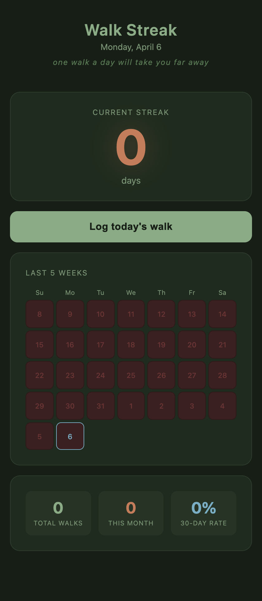

# Walk Streak

A minimal daily walk tracker that lives in a single HTML file. No installs, no accounts, no server — just open it and go.

**Live app → [anzhelaschults.github.io/walk-streak](https://anzhelaschults.github.io/walk-streak/)**

---

## Features

- **One-tap logging** — hit the button once to mark today's walk done
- **Streak counter** — tracks consecutive days; resets automatically if you miss a day
- **5-week calendar** — color-coded grid showing walked days, missed days, and today at a glance
- **Stats panel** — total walks all-time, walks this month, and 30-day completion rate
- **Offline-first** — all data stored in `localStorage`, works without an internet connection

## Preview



> Dark forest background · terracotta streak counter · sage green log button · color-coded 5-week calendar · stats row

## Usage

Open `index.html` in any modern browser. That's it.

```
open index.html        # macOS
start index.html       # Windows
xdg-open index.html    # Linux
```

Or visit the hosted version above.

## Design

- Dark forest background with nature-inspired pastels: sage green, dusty terracotta, soft sky blue
- Fully responsive, works on mobile
- No dependencies, no build step — everything is in one file

## Data

Walk history is saved in your browser's `localStorage` under the key `walk-streak-days`. It stays on your device and is never sent anywhere.

To reset your data, run this in the browser console:

```js
localStorage.removeItem('walk-streak-days')
```

## License

MIT
